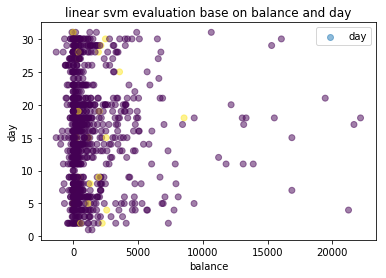
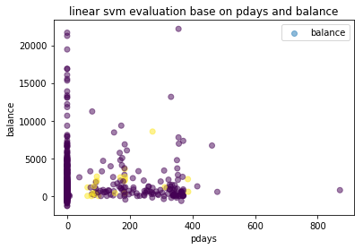

To help me with this assignment, I actually referenced the article at 
#https://scikit-learn.org/stable/auto_examples/compose/plot_column_transformer_mixed_types.html#sphx-glr-auto-examples-compose-plot-column-transformer-mixed-types-py
to familiarize myself with using Pipeline to facilitate the whole process with multiple sequential steps


```python
from __future__ import print_function
import matplotlib.pyplot as plt
import pandas as pd
import numpy as np

from sklearn.compose import ColumnTransformer
from sklearn.pipeline import Pipeline
from sklearn.impute import SimpleImputer
from sklearn.preprocessing import StandardScaler, OneHotEncoder
from sklearn.neighbors import KNeighborsClassifier
from sklearn.model_selection import train_test_split, GridSearchCV

# Read data from Titanic dataset.
data = pd.read_csv("../../data/bank/bank.csv", delimiter = ';')
#according to the dataset description, 'duration' should be dropped.
#Always make sure you carefully study the dataset description
data = data.drop('duration', axis = 1)

#detect any missing values
print(data.isna().any())

#the results show that there's no missing value in the dataframe

```

    age          False
    job          False
    marital      False
    education    False
    default      False
    balance      False
    housing      False
    loan         False
    contact      False
    day          False
    month        False
    campaign     False
    pdays        False
    previous     False
    poutcome     False
    y            False
    dtype: bool


```python
# We will train our classifier with the following features:

# We create the preprocessing pipelines for both numeric and categorical data.
numeric_features = ['age', 'balance', 'day', 'campaign', 'pdays', 'previous']

numeric_transformer = Pipeline(steps=[
    ('imputer', SimpleImputer(strategy='median')),
    ('scaler', StandardScaler())])

categorical_features = ['job', 'marital', 'education', 'default', 'housing', 'loan', 'contact', 'month', 'month', 'poutcome']
categorical_transformer = Pipeline(steps=[
    ('imputer', SimpleImputer(strategy='constant', fill_value='missing')),
    ('onehot', OneHotEncoder(handle_unknown='ignore'))])

preprocessor = ColumnTransformer(
    transformers=[
        ('num', numeric_transformer, numeric_features),
        ('cat', categorical_transformer, categorical_features)])

```


```python
# Append classifier to preprocessing pipeline.
# Now we have a full prediction pipeline.
knn = Pipeline(steps=[('preprocessor', preprocessor),
                      ('classifier', KNeighborsClassifier(n_neighbors = 5))])

X = data.drop('y', axis=1)
y = data['y']

X_train, X_test, y_train, y_test = train_test_split(X, y, test_size=0.2)

knn.fit(X_train, y_train)
#evaluating the algorithm: using score()
print("model score: %.4f" % knn.score(X_test, y_test))
```

    model score: 0.8729


#using pandas.get_dummies() to process the categorical values will get a very similar result with the result above.
#see hw4_failure_but_worth_continuing.py/ipynob


```python
#plot
#replace the category strings in target columns, so we can plot them as different colors
def replace(listlike, toreplace, target, step = 0):
    '''
    listlike: list, the target to 'replace' with new values
    toreplace: list, the strings to be replaced
    target: list, the respective numbers to replace the strings.
    step: int, the step to be added to target, optional
    '''
    replaced = []
    for z in listlike:
        for x,y in zip(toreplace, target):
            if z == x:
                replaced.append(y + step)
    return replaced

toreplace = ['yes', 'no']
target = [1, 0]
pred_plot = replace(y_pred, toreplace, target, 3)
target_plot = replace(y_test, toreplace, target, 2)

for x in numeric_features:
    for y in numeric_features:
        if x != y:
            plt.scatter(X_test[x], X_test[y], c = pred_plot, alpha = 0.5)
            #plt.scatter(X_test[x], X_test[y], c = target_plot, marker = '2')
            plt.xlabel(x)
            plt.ylabel(y)
            plt.title("knn evaluation base on %s and %s" % (x, y))
            plt.legend()
            plt.show()
```


As we can see from the diagrams above, there's probably no relation between the subscription results and any 2 of the numerical features, since there's no obvious boundary between the 2 target classes, 'yes' and 'no'.


```python
#evaluate the algorithm: using classification_report
from sklearn.metrics import classification_report
y_pred = knn.predict(X_test)

#print(classification_report(y_test, y_pred))
```


```python
from sklearn import svm
svmer = Pipeline(steps = [('preprocessor', preprocessor),
                      ('classifier', svm.SVC(kernel = 'linear'))])

svmer.fit(X_train, y_train)

#evaluating the algorithm: using score
print("linear svm score %.4f" % svmer.score(X_test, y_test))
```

    linear svm score 0.8939


```python
y_pred_svm = svmer.predict(X_test)
print(classification_report(y_test, y_pred_svm))
```

                  precision    recall  f1-score   support
    
              no       0.90      0.99      0.94       796
             yes       0.78      0.17      0.27       109
    
       micro avg       0.89      0.89      0.89       905
       macro avg       0.84      0.58      0.61       905
    weighted avg       0.88      0.89      0.86       905
    


```python
plot_svm_pred = replace(y_pred_svm, toreplace, target, 0)
for x in numeric_features:
    for y in numeric_features:
        if x != y:
            plt.scatter(X_test[x], X_test[y], c = plot_svm_pred, alpha = 0.5)
            #plt.scatter(X_test[x], X_test[y], c = target_plot, marker = '4')
            plt.xlabel(x)
            plt.ylabel(y)
            plt.legend()
            plt.title("linear svm evaluation base on %s and %s" % (x, y))
            plt.show()
```








As we can see from the diagrams above, there's probably no relation between the subscription results and any 2 of the numerical features, since there's no obvious boundary between the 2 target classes, 'yes' and 'no'.
This is roughly the same with the result of KNN.


```python

```
